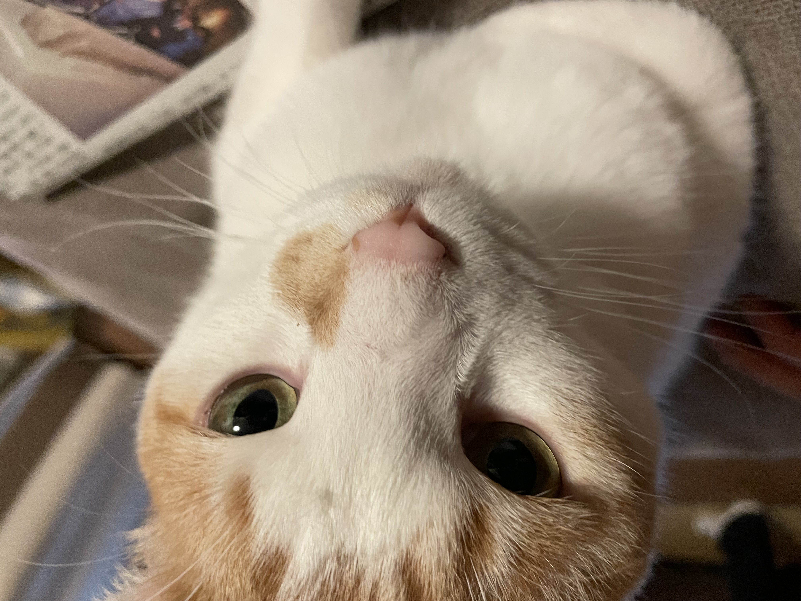
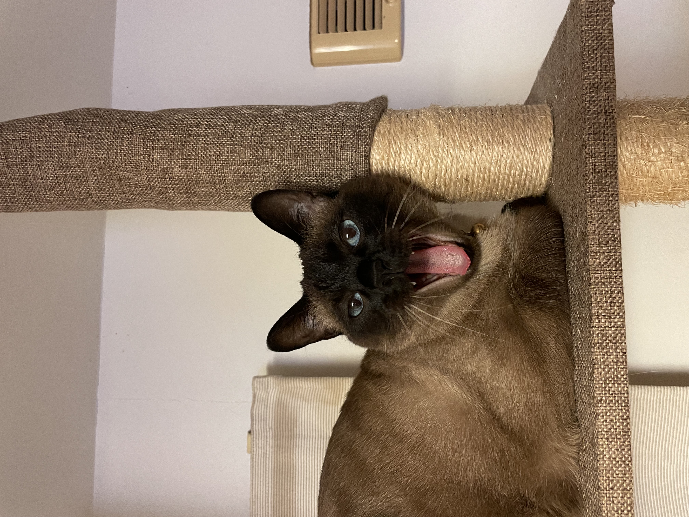
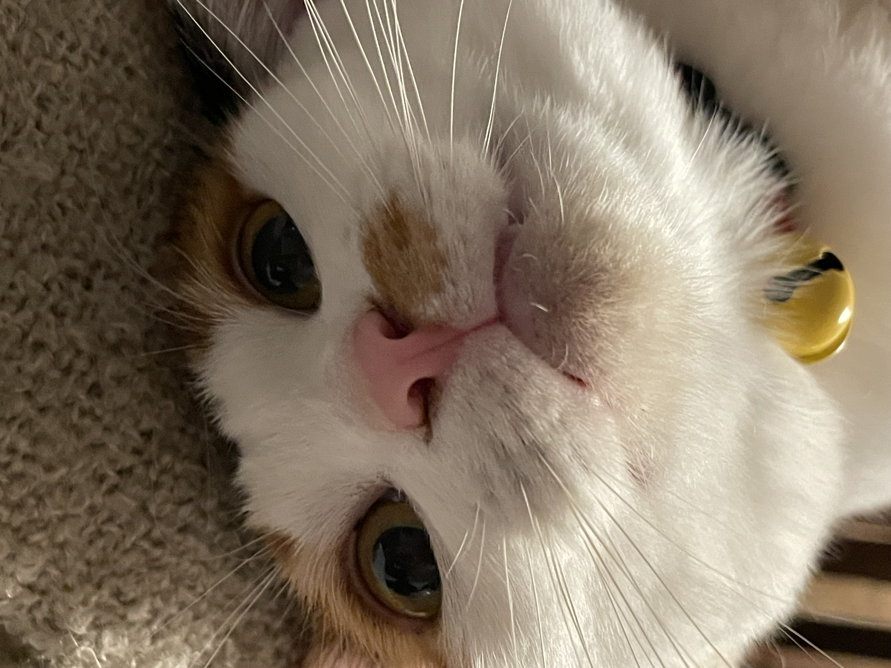

## MARUINO Project

これはdomaとnororiの共同プロジェクトです．
またの名をMARUINOといいます．
これは私の飼っている猫の頭文字から取得しました．
- MARU
- RUI
- NONO

## Features
- 朝・昼・夜の給餌をワンクリックで記録
- 給餌時刻をリアルタイムで表示
- 家族全員で給餌状況を共有

## Setup
```bash
git clone https://github.com/yuma-yuma-222/Cat-feeding-manager.git
cd Cat-feeding-manager
pip install -r requirements.txt
```

## Usage
```bash
uvicorn src.main:app --reload
```

## my cats
↓maru


↓rui


↓nono

